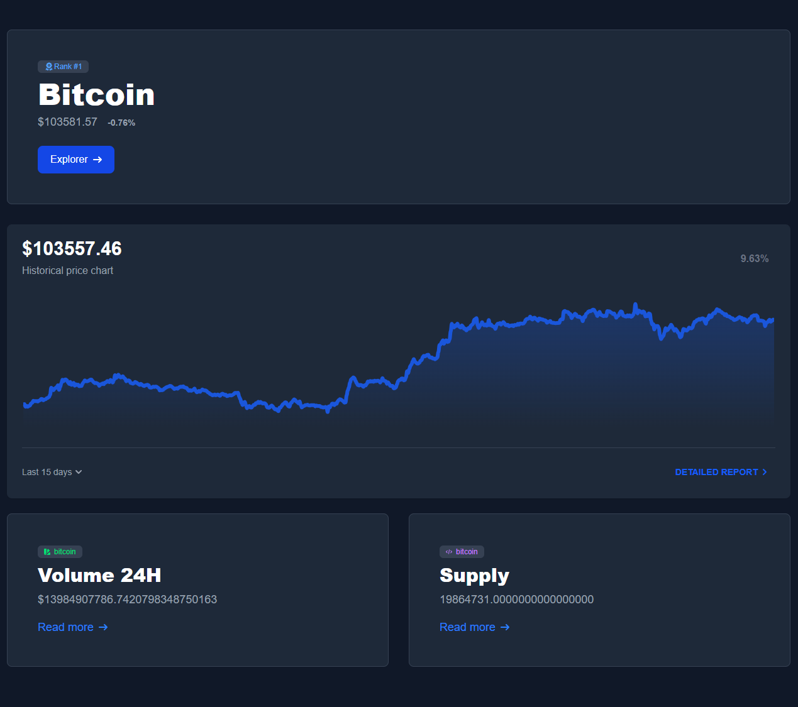
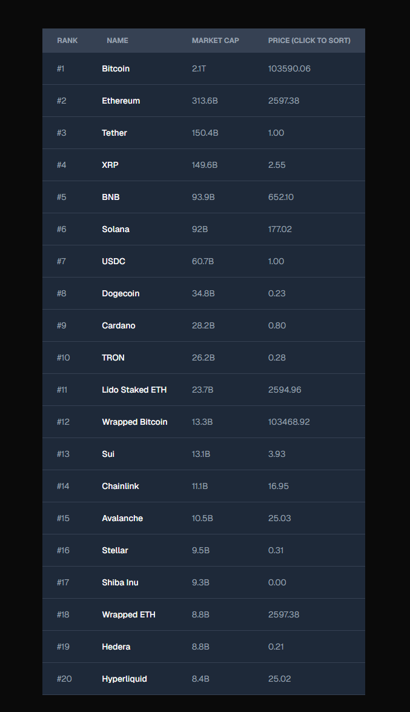

Hosted on https://coincap-dune-zfda-fo26rpb1r-kunsachdevas-projects.vercel.app/

## Preview




## Getting started

Create `.env` with variable name `NEXT_PUBLIC_API_KEY=`


First, run the development server:

```bash
npm run dev
# or
yarn dev
# or
pnpm dev
# or
bun dev
```

Open [http://localhost:3000](http://localhost:3000) with your browser to see the result.

Click on any coin to navigate to page with more information about the coin

## Routes

`/` - Is the default route that lists coins
`/coin/[id]` - Shows data about the given coin

## Folder structure

`app` - Contains pages & layout
`components` - Reusable components to be shared across pages
`context` - Contains all contexts set deep state
`network` - Network calls & corresponding constants
`types` - Global types shared across components
`utils` - Utitlies

## Notable points

- Uses async components supported by NextJS SSR
- NEXT_PUBLIC_ env var is used for polling but ideally we would use SSE or websockets
- Implemented custom sorting to demonstrate, ideally we would use existing component
- Not using redux because React now has hooks to replace it - most modern apps don't use redux/mobx to implement one-way state management. Not that it was required by this app.